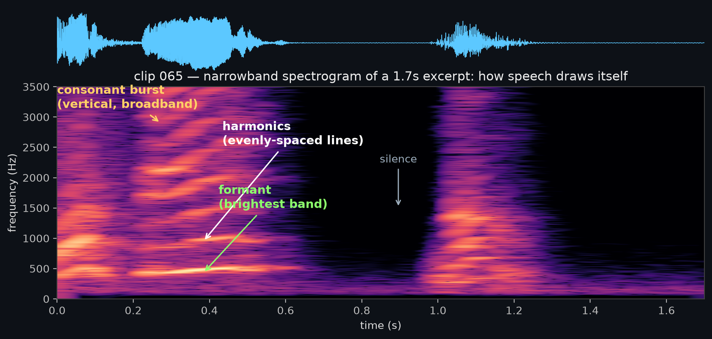
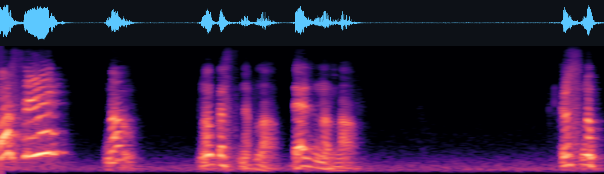
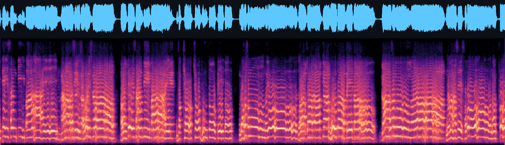
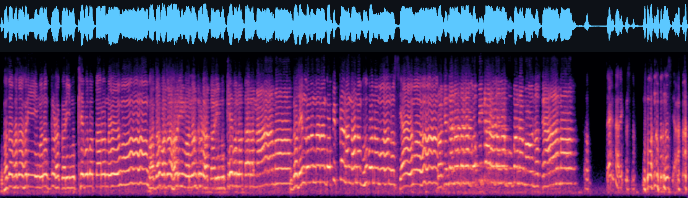
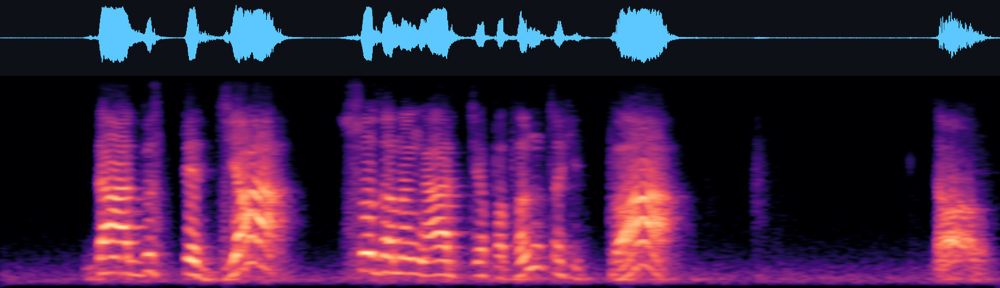

# Spectrogram triage — a detail sheet (read in VSCode preview: `Ctrl`+`Shift`+`V`)

A field guide for the QA pass, built from **your own lecture-1 clips**. Goal: glance at the
waveform+mel image and predict a clip's quality *before* you listen, so the ear-check is fast.
This is practical reading only — the *theory* (STFT/mel math) is Tier-① L15–18, needed later at the
fine-tune, **not** here. Your ear is the instrument; the picture is a speed-up. See [[learning-path]].

---

## 0. How to read the picture (30-second primer)

Each thumbnail has two stacked, **pixel-aligned** panels (same time on the x-axis):

```
 ┌───────────────────────────────────────────────┐
 │  WAVEFORM   (blue)   amplitude vs time          │  ← loudness shape; silence = flat line
 ├───────────────────────────────────────────────┤
 │  MEL SPECTROGRAM                                │  ← y = frequency, LOW at bottom → HIGH (8 kHz) at top
 │     bright = lots of energy at that freq+time   │     x = time (use the ruler / hover readout)
 └───────────────────────────────────────────────┘
```

Three things to recognise in the mel panel:

- **Stacked horizontal stripes** (lower–middle) = **harmonics** of a voiced sound (a vowel). Which
  stripes are brightest = **formants** = vowel + timbre = *who is speaking*. This is the GGS fingerprint.
- **A bright vertical streak** spanning many frequencies = a sharp consonant / plosive (a "t", "k").
- **A black column** = **silence** (no energy). Black gaps between bright columns = the pauses between words.

> Brightness is *relative to the loudest moment in that clip* (the `power_to_db(ref=max)` from L9/L18).
> So you read **shape and contrast**, not absolute colour.

---

## 0.5 Harmonics, formants & consonants — labeled on real data (clip 065)



*A narrowband zoom of a 1.7 s excerpt of clip 065. (Narrowband = long FFT window → resolves the individual
harmonic lines that the mel thumbnails deliberately blur together.)*

The Sound-of-AI slides (L2 *Sound & waveforms*, L3 *Timbre*) give the exact chain of vocabulary:

- A **complex sound is a "superposition of sinusoids"**; each sinusoid is a **partial**.
- The **lowest partial = the fundamental frequency** = your pitch (the vocal-cord buzz rate).
- A **harmonic partial = "a frequency that's a multiple of the fundamental"** → the **evenly-spaced ladder**
  (white arrow). A ~130 Hz buzz ⇒ lines at 130, 260, 390, 520 Hz…
- **Timbre = "distribution of energy across partials"** — i.e. *which* rungs of that ladder are loud. In
  **speech**, the bright bands where the vocal tract boosts certain partials are called **formants** (green
  arrow). Same ladder + different bright bands = different vowel = **the GGS fingerprint**.
- A **consonant** ("t"/"k") is an aperiodic **burst** — broadband but instantaneous → a **vertical** streak
  (yellow arrow). A **black column** = silence.

> The course names the timbre feature "harmonic content / distribution of energy across partials";
> **"formant"** is the speech-specific word for the resonance peaks that shape that distribution.

---

## 1. The reference: what a CLEAN clip looks like  — clip 065



This is your gold standard. Note:
- **Bright vertical word-blocks** with crisp **harmonic stripes** in each → clear voiced speech.
- **Deep-black gaps** between words (and one big black silence ~⅔ across) → real silence, no haze.
- Waveform sits well within the rails (peak ≈ 0.85, never slammed flat) → no clipping.

**Decision: KEEP.** Whenever a clip looks roughly like this, it's a keep — listen once to confirm it's
GGS and matches the text, then `K`.

---

## 2. NOISE / continuous energy — clips 099 & 081





Contrast with clip 065: **there are almost no black gaps.** Energy (haze) fills the whole panel
top-to-bottom, and the waveform never returns to a flat line. In your data this measured as a high
**noise floor** (quiet frames only ~17–20 dB below peak, vs −42 dB for clip 065).

**The honest catch:** this look has *two* causes, and only your ear separates them —
- **Continuous fast speech with no pauses** (often the real cause here) → the haze is just dense speech + a little room ambience → usually **KEEP** if it's clean GGS.
- **Genuine background noise / hiss / heavy reverb** → you'll *hear* a constant hum or echo under the voice → **CUT**, it bleeds into the learned timbre.

**Decision: LISTEN, then decide.** "No black gaps" is a *flag to use your ears*, not an automatic cut.

---

## 3. DEAD AIR at an edge — clip 011 (lead) & 024 (trail)



A clip should *start and end near speech*. Here the **right third is flat waveform over black
spectrogram** — that's trailing dead air. The gate already measures this (`lead_sil`/`trail_sil`, the
L9 silence edges) and flags big ones.

**Decision: usually KEEP, it's cosmetic.** A bit of edge silence won't ruin training (the cutter trims
it). Only **CUT** if the dead air is huge *and* the actual speech is tiny, or if a word is sliced off at
the very edge (energy runs hard into the boundary with no taper → a chopped word).

---

## 4. CLIPPING — (cue only; absent in this lecture)

Not present in lecture 1 (max peak ≈ 0.95, 0.00 % clipped — the recordings are well-leveled). But know
the cue for future lectures:
- **Waveform flat-topped**, slammed against the ±1 rails like a plateau instead of a rounded peak.
- Mel panel shows **smeared bright junk at high frequencies** (the distortion harmonics).
- It *sounds* harsh / crackly. **Always CUT** — the model would learn the crackle as "his voice."

---

## 5. SECOND VOICE — (cue only; the pipeline already removed most)

Your diarization + speaker-verification stage dropped 13 % of words as non-GGS, so a clean questioner
clip is rare in this set. The cue if one slips through:
- A stretch whose **harmonic spacing / formant pattern visibly differs** from the rest (a different
  pitch → differently-spaced stripes).
- You'll *hear* a different voice, often asking a question. **CUT** — protecting speaker identity is the
  single most important thing in the dataset.

---

## 6. The numbers under each clip — what they mean, and which to trust

Every clip shows a row of QA metrics (from `qa_asr_report.tsv`, computed in
[cloud/pod_dataprep.py](cloud/pod_dataprep.py)). The single most important thing: **two of them are
reliable, the rest are Sanskrit-biased noise — don't cut on the noisy ones.**

| metric | what it measures | how it's computed | trust |
|---|---|---|---|
| **dur** | clip length (seconds) | the cutter, bounded to min/max sec | info |
| **lead-sil** | seconds of silence *before* speech starts | `silence_edges` — RMS→dB, front frames under −40 dB (L9) | ✅ reliable · gate >0.6 s |
| **trail-sil** | seconds of silence *after* speech ends | same, at the back | ✅ reliable · gate >1.0 s |
| **align-min** | the **worst** single word's alignment confidence | CTC aligner (MMS) log-prob per word; nearer 0 = surer the word is really there | ⚠️ advisory (display-only now) |
| **align-mean** | the **average** alignment confidence over the clip | mean of the per-word scores | ⚠️ advisory |
| **cer-core** | character-error of the **English** words only (Whisper vs reference) | re-transcribe w/ Whisper → `jiwer.cer`, Sanskrit masked out of both sides | ⚠️ Sanskrit-biased · gate >0.85 |
| **wer** | word-error over the **whole** transcript | Whisper vs reference, all words | ❌ heavily Sanskrit-biased (display-only) |
| **⚑ reasons** | **why** the clip is FAIL | the list of gates it tripped | read this *first* |

**Why some can exceed 1.0:** CER/WER = edits ÷ reference length, and Whisper *hallucinations* add
insertions — so `cer-core 1.25` = 125% error. On a mostly-Sanskrit clip with few English words, two
Whisper slip-ups blow the ratio up. **High CER usually means "this clip is Sanskrit," not "bad audio."**

**Trust hierarchy (the rule that makes the audit fast):**
- **Structural metrics — trust them:** `dur`, `lead-sil`, `trail-sil`. Pure audio, no transcription, no
  Sanskrit problem.
- **Text-match metrics — distrust them on Sanskrit:** `cer-core`, `wer`, and even `align-*`. They punish
  exactly the verses you want to KEEP (Whisper can't spell Sanskrit; the aligner is less sure of it).
- **Read `⚑ reasons` first:**
  - only `high_cer_core` (or `low_align`) → almost certainly a **Sanskrit false-alarm** → listen → likely **KEEP**.
  - `lead_sil` / `trail_sil` / `all_silence` → a **structural** issue → real, but usually just trimming
    (see §3); cut only if a word is chopped or there's no real speech.

> Right now the **alignment gate is off** (`min_align` un-calibrated), so the *only* things flipping clips
> to FAIL are `high_cer_core` and the silence gates. That's why nearly all your FAILs are CER-only — the
> metric we trust **least**. Your overrides will tell us whether to drop CER as a gate entirely.

### Worked example — your clip 5 (the one you pasted)

```
dur 5.64s · lead-sil 0.00 · trail-sil 0.00 · align-min −47.3 · align-mean −7.5 · cer-core 1.25 · wer 1.00 · ⚑ high_cer_core(1.25)
```

- **lead-sil 0.00, trail-sil 0.00** → perfectly trimmed, no silence problem *(structural = clean)*.
- **align-mean −7.5** → the clip aligned fine overall; **align-min −47.3** → just one word the aligner
  doubted (a Sanskrit term).
- **cer-core 1.25, wer 1.00** → Whisper's text disagrees a lot — *expected* for Sanskrit-heavy speech.
- **⚑ high_cer_core(1.25) is the only reason it's FAIL.** Every reliable signal says clean.

**Verdict: textbook Sanskrit false-alarm** — structurally perfect, failed only on the metric we trust
least → **listen once → almost certainly KEEP** (and jot `N`: *cer false-alarm, sanskrit*).

---

## The decision table

| You see / hear | Verdict |
|---|---|
| Crisp word-blocks + **black gaps** (like 065) | **KEEP** |
| High-CER Sanskrit verse, but clean GGS + matches text | **KEEP** (gate false-alarm) |
| **No black gaps / haze everywhere** | **LISTEN** → keep if dense speech, cut if hum/echo |
| Big edge dead-air, tiny speech, or a **chopped word** at the boundary | **CUT** |
| Flat-topped waveform, harsh sound (clipping) | **CUT** |
| A different voice / formant pattern (questioner) | **CUT** |
| Cough / laugh / "hmm"-only, audio ≠ transcript | **CUT** |

**One-line rule:** *Keep clean GGS speech that matches its text; the picture tells you where to point
your ears, the ears make the call.*
